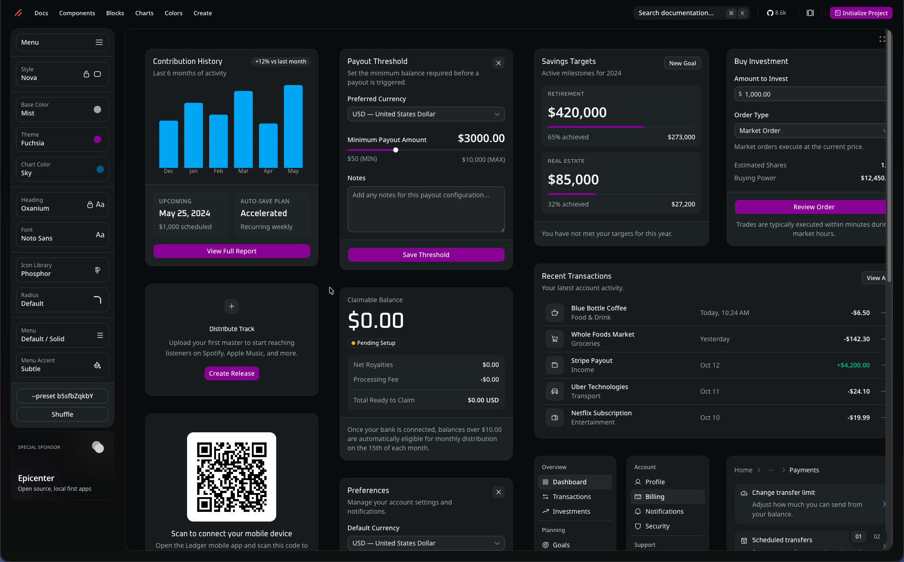

# Noteagotchi

A desktop app built with Tauri 2, SvelteKit, and TypeScript.

## 📋 Prerequisites

- [Node.js](https://nodejs.org/)
- [pnpm](https://pnpm.io/) (v10+)
- [Rust](https://www.rust-lang.org/tools/install)

## 🚀 Getting Started

```bash
# Ensure Rust toolchain is up to date
rustup update

# Install dependencies
pnpm install

# Run the desktop app in dev mode
pnpm dev
```

This starts the Vite dev server on port 1420 and opens the Tauri window.

IDE Setup: [VS Code](https://code.visualstudio.com/) + [Svelte](https://marketplace.visualstudio.com/items?itemName=svelte.svelte-vscode) + [Tauri](https://marketplace.visualstudio.com/items?itemName=tauri-apps.tauri-vscode) + [rust-analyzer](https://marketplace.visualstudio.com/items?itemName=rust-lang.rust-analyzer)

## ⚡ Commands

| Command          | Description                         |
| ---------------- | ----------------------------------- |
| `pnpm dev`       | Run full desktop app in dev mode    |
| `pnpm storybook` | Run Storybook on port 6006          |
| `pnpm build`     | Build the final desktop application |
| `pnpm check`     | Type-check TypeScript/Svelte        |
| `pnpm lint`      | Run ESLint                          |

<details>
<summary><h2 style="display: inline">🏗️ Architecture</h2></summary>

- **Tauri 2** - Desktop app framework (Rust backend)
- **SvelteKit** - Frontend framework (Svelte 5 runes)
- **shadcn-svelte** - UI components (https://shadcn-svelte.com/)
- **Storybook** - Component development and documentation
- **TypeScript** - Type safety

</details>

<details>
<summary><h2 style="display: inline">⚙️ Backend Development</h2></summary>

coming soon...

</details>

<details>
<summary><h2 style="display: inline">🎨 Frontend Development</h2></summary>

### Styling

Based on [the theme here](https://shadcn-svelte.com/create/preview?preset=b5sfbZqkbY).



### Storybook

Storybook is generally used for component development. Ideally we can see most of the app through storybook stories. Then for full end-to-end functionality we test locally with Tauri. The more we are able to test in Storybook, the more we know our components are well broken-down and the boundaries between backend data + presentation are clear.

### Base UI Components (`src/components/ui`)

Use the `/add-new-shadcn-component` Claude skill, or see [that skill](.claude/skills/add-new-shadcn-component/SKILL.md) for the steps. Provide the skill the [names of the components you want added](https://ui.shadcn.com/docs/components), and it will take care of downloading, adjusting to our standards, and creating storybook stories for your viewing pleasure. ✨

### UI Components

General (non-atomic shadcn components) components go in the `/components` folder, and each one gets it's own top level folder. So if we have a `NoteInput` component, then that gets its own folder, and the component itself is named `NoteInput.svelte`.

### UI Pages

Full pages, which are made of components, and base UI components, go in the `src/pages` directory, and are named very similarly to the UI components. For example, `DashboardPage` gets its own folder, and `DashboardPage.svelte` is the file name.

### Path Aliases

Configured in `svelte.config.js`:

- `$components` → `src/components`
- `$ui` → `src/components/ui`
- `$util` → `src/util`
- `$stores` → `src/stores`
- `$services` → `src/services`
- `$pages` → `src/pages`
- `$storybook` → `.storybook/`

</details>
